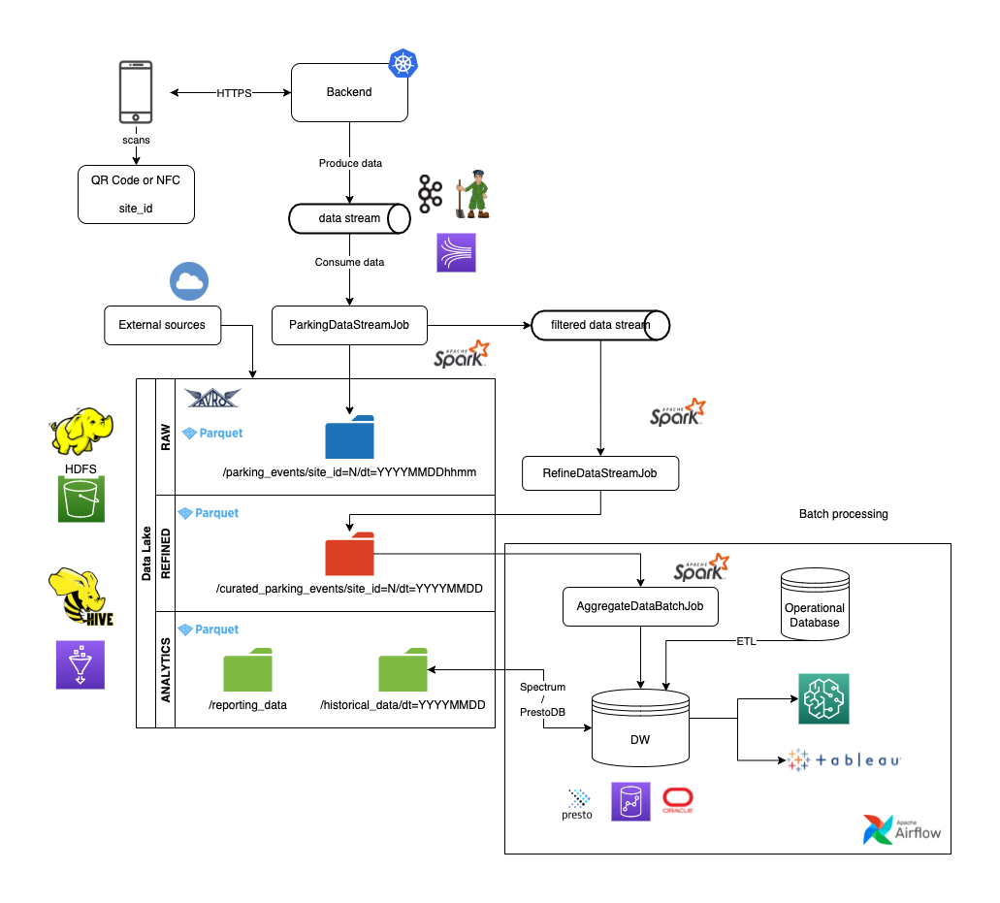
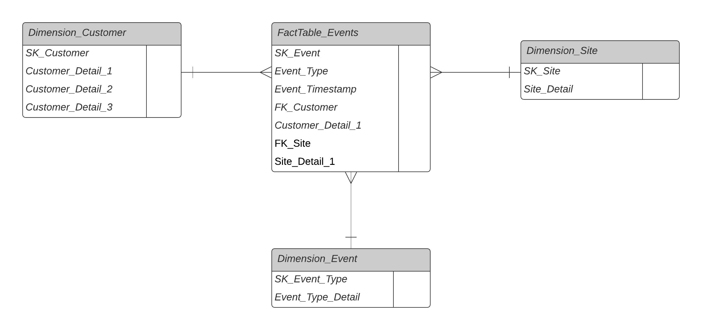

## Exercise 1 - OLAP Architecture / Analytical system
Questions: What tracking events would you propose? What data model for event analysis? What technologies?

### Events to be tracked
The architecture I propose to administer the analytical data that come from the solution is the following:

The events that will be tracked are:
* User registry: the first time the user logs into the system
* Vehicle arrival: the vehicle is scanned when entering the parking lot
* Vehicle departure: the vehicle is scanned when leaving the parking lot
* Service payment: the user pays for the service though the app

### Data model
The data model used in the Data Warehouse will be a star model that looks like this:

### Technologies / Architecture
* Event data streams: the selected technologies are Kafta or, if working in a full cloud ecosystem, the selected one is Kinesis. This type of technologies allow for distributed readings from a data stream use that, in this case, would be the backend service of the solution.
* Data Lake: the objective will be to store the data from other sources as well as the raw events that are generated in the app and to be a staging area for the Data Warehouse, the place where the events will be stored once they have been aggregated by user. Besides, it allows for the flexible organization of the data in three different areas: RAW, which is the place where raw and compressed events are stored, REFINED, which is the place where data is already clean and standarized and, lastly, the analytics area, where reports, tables, ML result models results and more are stored. The objective of this last area is to store the analysis ad hoc and the Data Warehouse’ historic data to save costs.
* Data Warehouse: it will be used to store the data at expired hours, i.e. no real time data. The data of already cleaned and aggregated events will be stored executing jobs in the batch way.
* Airflow: it will be used to orchestrate the jobs batch depending on the use case of each enterprise’s area.
* Spark Streaming: in order to obtain and analyze the data in real time, Spark Streaming will be used to process the data of the real time layer.
* SageMaker: a managed service will be used to train the models, store the features, the hyperparameters and the service of each model.
* PrestoDB / Redshift Spectrum: it allows running federated queries.
