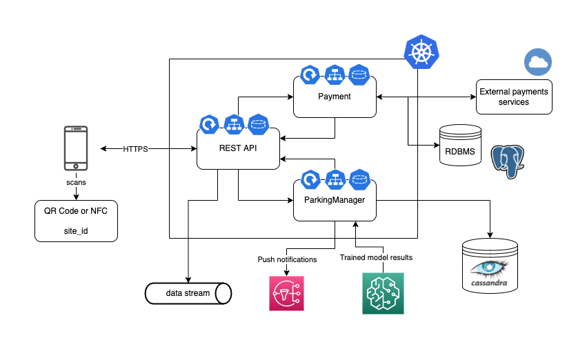
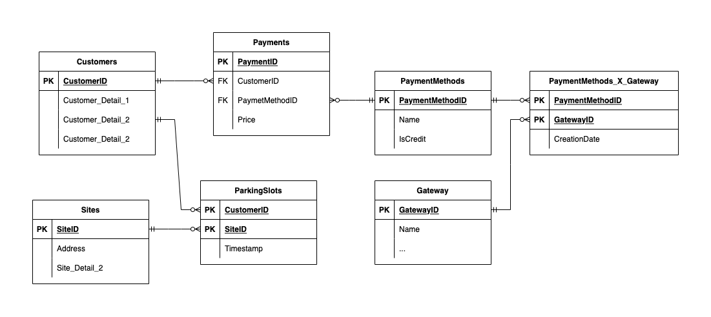

## Exercise 2 - OLTP Architecture / Operational system
Questions: How would you design the Backend system? What data model for the Operational system? What
technologies?

### Architecture
A super simplified diagram of the solution architecture proposed is the following:

The information flow is as follows:
1. The user scans the QR or NFC and sends the information to a Backend server deployed on a Kubernetes cluster.
2. The API REST service of the backend service takes the event information and sends it through a socket to the ParkingManager service, which is in charge of the administration of the free/taken spots of the parking lot. Besides, the API REST service sends the event to a data stream to be processed by the analytical system.
3. The Parking Manager service stores the information of the events in a Cassandra database to write a huge amount of arrivals of many cars and the departures of many others.
4. Once every given period of time, a scheduled job takes the data of Cassandra and sends them to the SageMaker service to obtain the results of the model that predicts the parking lot’s capacity for the next hours.
5. If it detects that there will soon be an excessive load of cars in the parking lot, it sends a push notification with AWS SNS that is received by the app.
6. The service payment is in charge of the payment and is also in charge of the administration of the data in a way that is consistent with a RDBMS like PostgreSQL. It communicates with external services to carry out the payments digitally.

### Data model
The objective of this model is to respect the relational modeling, where the non-duplication and the consistency of the data are prioritized.
Therefore, the next model is proposed:

### Technologies
The main technologies that would be used are:
* Kubernetes: it allows for the creation of a backend service oriented to microservices that can escalate independently, taking into account the user volume, which can change through time.
* Microservices: they can be developed in robust technologies like .NET, Spring Framework (Java) or in more modern technologies like Node.js.
* RDBMS: to keep consistency in the information generated by the payments it is necessary to use a relational database.
* Cloud services: the proposed services are useful as an example, but it is necessary to use certain administered cloud services if the budget allows it, in order to speed up the solution’s development.
* Cassandra: thanks to its great capacity of writing and also of making aggregated queries at the column level, it allows to keep the events and consult them to obtain information on the current and future parking lot’s capacity.
* * Data Streams: they allow the connection of the operational data to the analytic architecture of the completed solution.
