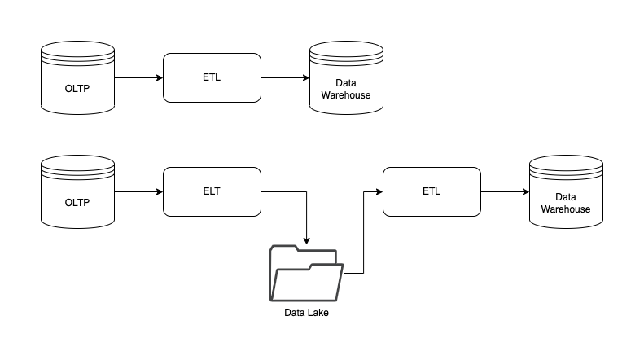
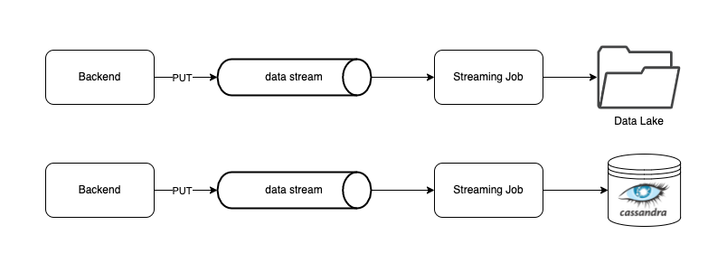
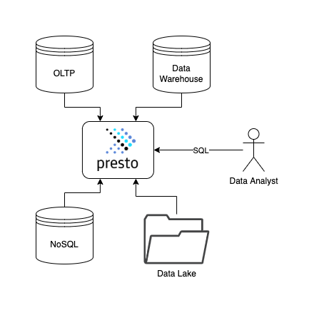

## Exercise 3 - Combining Operational and Analytical architecture
Questions: Explain how to combine the operational architecture with the analytical one?

The key tool to combine both systems is the ETL or ELT, depending on the use case that is being used.
This alternative’s drawback is that it works with “expired” data, because they are run in the batch way and not in real time.

Another alternative is to work with data stream alternatives, as was proposed in the solution: 

In this case, the ETL will be a streaming job created with Spark. As regards the destiny of the data, one should take into account options that have a very high writing capacity, such as a columnar and p2p database like Cassandra.

Lastly, there is the possibility of executing federated queries that allow to cross data without the need to store them in the same repository:

The problem that arises from this solution is that, many times, it ends up being too expensive, because Presto, to name one of the existing tools as an example, consumes a lot of compute resources when doing various Map Reduce jobs.
