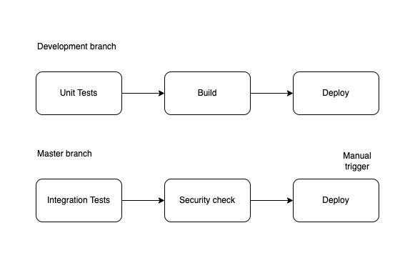

## Exercise 4 - Development lifecycle and CI/CD
Questions: Could you propose a process to manage the development lifecycle? And the test and deployment automation?

To organize the development inside the team, a classic giftflow could be used:

It allows to gain independence between the teams and isolation between the low and productive environments.

So, if the team needs to add a new feature to a Spark job or to an Airflow DAG, these steps could be followed:
1. Create a branch with the feature’s name: `feat-add-data-cleansing` and develop the functionality.
2. When it is time to integrate it to the branch, create a Merge Request and ask your leader to make a code review. Besides, in this stage, the pipeline of CI/CD executes the unit tests.
3. The MR is accepted and the new version of the ETL is deployed in a staging environment that is connected to a sandbox environment of the data repositories to make a complete integration test.
4. If the tests are correctly executed, the code is deployed in the productive environment and it is monitored with the tool of Data Quality that the enterprise has available at the moment. One example would be [Great Expectations](https://greatexpectations.io/).
5. If a hotfix has to be implemented, it can be directly done on the release branch and the change can be replicated on the remaining branches.
   
Therefore, the pipeline of CI/CD would be as follows:

For the pipelines of CI/CD, different technologies can be used:
* Azure DevOps
* Gitlab CI/CD
* Github Actions
