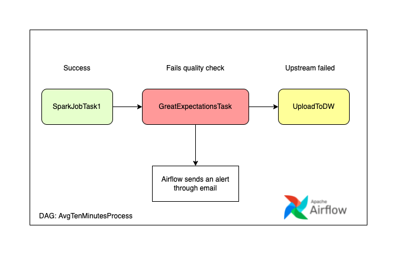

## Solution proposal
To be able to carry out a test in a Spark job in an agile way, the following should be considered:
* Encapsulate the business logic in an ETL class to instantiate in the unit tests each method of said class.
* The methods of transformation or steps done in the ETL can be created with the following signature:
   ```scala
   import org.apache.spark.sql.DataFrame
   def transformationOne(df: DataFrame): DataFrame = {};
  ```
  This way, it is easy to create a testing DataFrame and execute “asserts” to try each method.
* If the budget allows it, have a sandbox area to take the data that are closer to reality when doing an integration test.

### Unit tests
In the case of `AvgTenMinutesETL` a unit test can be created with each method by making it receive a testing DataFrame and monitoring its result:
```scala
import org.apache.spark.sql.SparkSession
import org.scalatest.{BeforeAndAfter, FlatSpec, Matchers}

class WordCounterTest extends FlatSpec with Matchers with BeforeAndAfter {

  var spark: SparkSession = _

  before {
    spark = SparkSession.builder
      .appName("AvgTenMinutesJob")
      .master("local[*]")
      .getOrCreate()
  }

  after {
    sc.stop()
  }

  behavior of "Transform Aggregate DF Ten Minutes"

  it should "aggregate data to ten minutes" in {
    val avgTenMinutesETL = new AvgTenMinutesETL(spark)
    val testDf = spark.createDataFrame(...)
    
    val resultDF = avgTenMinutesETL.transformAggDfTenMinutes(testDf)

    resultDF.collect() should contain allOf (...)
  }
}
```

### Integration tests
For this case, the situation is more complex, but a testing file could be created, and finally a test could be executed reading the result in the test:
```scala
import org.apache.spark.sql.SparkSession
import org.scalatest.{BeforeAndAfter, FlatSpec, Matchers}

class WordCounterTest extends FlatSpec with Matchers with BeforeAndAfter {

  var spark: SparkSession = _

  before {
    spark = SparkSession.builder
      .appName("AvgTenMinutesJob")
      .master("local[*]")
      .getOrCreate()
  }

  after {
    sc.stop()
  }

  behavior of "AvgTenMinutesETL execution"

  it should "aggregate data to ten minutes" in {
    val avgTenMinutesETL = new AvgTenMinutesETL(spark)
    
    avgTenMinutesETL.execute("testInputPath/", "testOutputPath/")
    
    val resultDF = spark.read.csv("testOutputPath/")

    resultDF.collect() should contain allOf (...)
  }
}
```

### Data Quality check
For the processing of a data quality control stage, it is necessary to combine the execution of this job with another one who carries out the data control and, if it fails, issues an alert through an email.

This solution can be achieved by using Spark, Airflow and a Data Quality framework such as Great Expectations.
